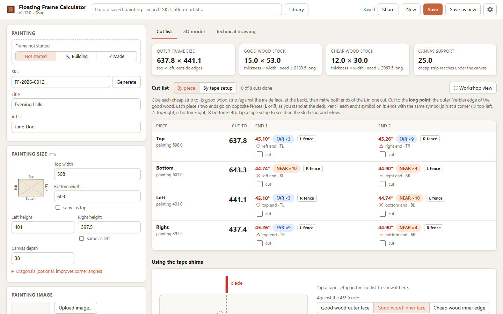
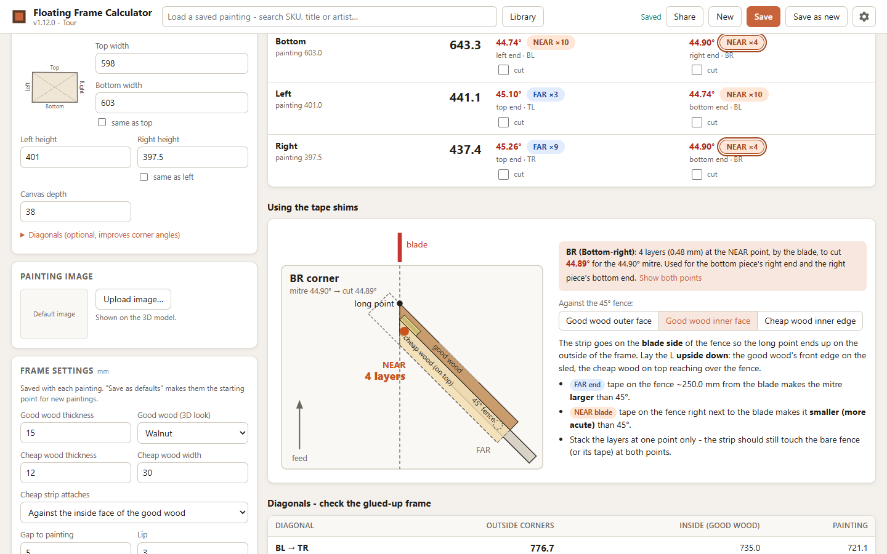
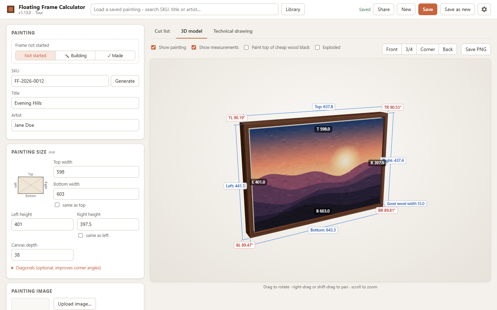
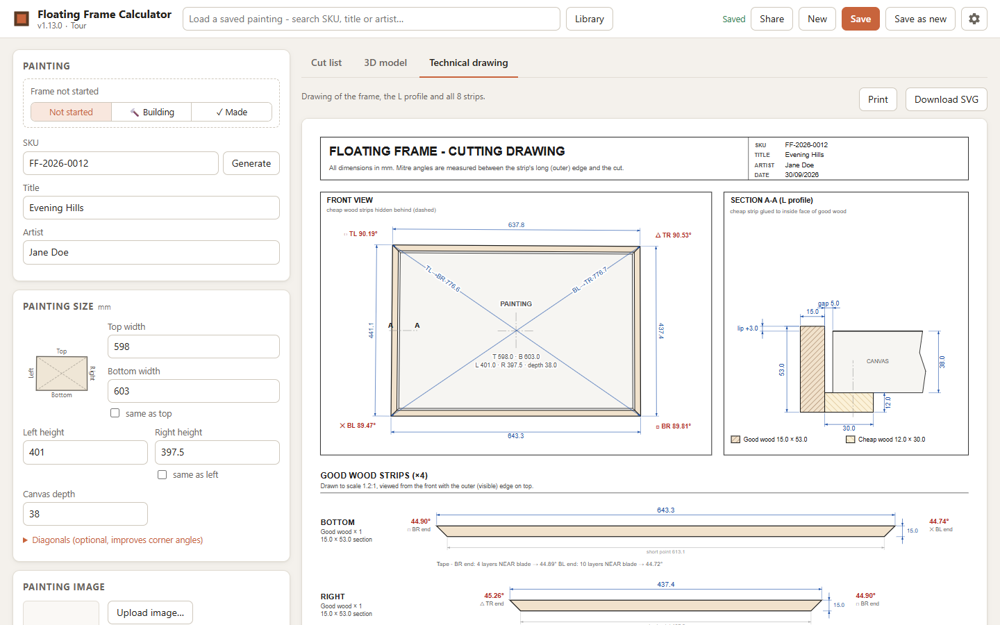
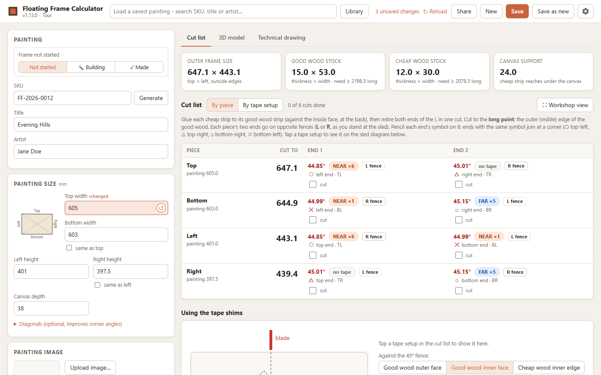

# Floating Frame Calculator

A local web app for working out the wood strips to cut for floating frames. Each frame side is an **L**: a good-wood strip (the part you see) with a cheap-wood strip (pine) glued at its base, which is screwed into the back of the painting.



<table>
  <tr>
    <td width="50%"></td>
    <td width="50%"></td>
  </tr>
  <tr>
    <td><b>Tape shims.</b> Click a corner to see how many layers of masking tape go where on your 45° sled.</td>
    <td><b>3D model.</b> The finished frame with the painting in it. Rotate, zoom and show measurements.</td>
  </tr>
  <tr>
    <td width="50%"></td>
    <td width="50%"></td>
  </tr>
  <tr>
    <td><b>Technical drawing.</b> The frame, the L profile and all 8 strips with dimensions, ready to print.</td>
    <td><b>Unsaved changes.</b> Changed values are highlighted. Hover to revert one, or Reload to discard them all.</td>
  </tr>
</table>

To retake these after changing the app, run `sh docs/take-screenshots.sh` from Git Bash. It uses a temporary example painting, so your own data isn't touched.

## Running it

Requires Python 3.9+ (no packages to install).

- Double-click **`start.bat`**, or
- run `python server.py`

Your browser opens at <http://127.0.0.1:8765>. Stop the app with Ctrl+C in the console window.

### Opening it from other devices

Other devices on your network (a phone, a tablet in the workshop, another PC) can connect too. The console shows the address to use, e.g. `Other devices on your network: http://192.168.1.20:8765/`.

- **Windows Firewall:** the first time you run it, Windows asks whether to allow Python (or `FloatingFrame.exe`) on the network. Tick **Private networks** and allow it. If you dismissed the prompt, allow it under *Windows Security → Firewall & network protection → Allow an app through firewall*.
- There are no logins. Anyone on your network who opens the address can view and edit your saved paintings, so only use it on a network you trust.
- To allow only this computer, run `python server.py --local-only`.

Other options: `--no-browser` (don't open a browser), and the environment variables `FRAME_PORT`, `FRAME_HOST` and `FRAME_DATA` (data folder).

## Packaging

```
python build.py        # dist/floating-frame.pyz + dist/install-pi.sh
python build.py exe    # also dist/FloatingFrame.exe (Windows, no Python needed)
```

| File | Runs on | How |
|---|---|---|
| `FloatingFrame.exe` | Windows | Double-click it. No Python needed. |
| `floating-frame.pyz` | Windows, Raspberry Pi, Mac, Linux (Python 3.9+) | `python floating-frame.pyz` (Windows) or `python3 floating-frame.pyz` (Pi) |

Each package keeps its `data/` folder next to itself. To move your saved paintings between machines, copy the `data` folder.

The `exe` build installs PyInstaller into a private `build/venv`. It builds for the platform you run it on: a Windows exe on Windows, or an ARM binary if you run it on the Pi. On the Pi you don't need an exe; the `.pyz` is enough.

### Raspberry Pi

1. Copy `dist/floating-frame.pyz` and `dist/install-pi.sh` to the Pi, for example with a USB stick or `scp dist/* pi@raspberrypi.local:~`.
2. On the Pi, run `sh install-pi.sh`.

This installs the app to `~/floating-frame` as a service that starts at boot. It listens on your network, so you can open `http://<pi-ip>:8765` from a PC, tablet or phone as well as on the Pi itself.

- **Update:** run the script again with a newer `.pyz`. Your data is kept.
- **Stop or remove:** `sudo systemctl disable --now floating-frame`

The 3D view needs WebGL. Chromium on a Pi 4 or 5 handles it; a Pi 3 will be slow.

### Cloud VPS (e.g. Oracle Cloud)

`install-vps.sh` sets the app up for the internet:

- **HTTPS:** [Caddy](https://caddyserver.com) sits in front of the app. The app itself only listens on the server (`127.0.0.1`), so everything goes through Caddy.
- **Accounts:** everyone signs in, and each account has its own **private library** of paintings.
- **Sign-up:** people can create their own account with an **invite code** that you share with them.

The script is meant for Ubuntu 22.04/24.04 and Oracle Linux 8/9, on x86 or ARM.

1. **Open ports 80 and 443 in the Oracle Cloud console.** Go to *Networking → Virtual cloud networks → your VCN → Security Lists → Default Security List → Add Ingress Rules*, and add: source CIDR `0.0.0.0/0`, IP protocol TCP, destination port range `80,443`.
2. **Copy the files to the server:**
   ```
   scp dist/floating-frame.pyz dist/install-vps.sh ubuntu@<server-ip>:~
   ```
   On Oracle Linux the user is `opc` rather than `ubuntu`.
3. **On the server**, run `sh install-vps.sh`. It:
   - installs the app as a service;
   - installs Caddy;
   - opens ports 80 and 443 in the server's own firewall;
   - asks you to create your own account. The first account takes over any paintings already on the server;
   - offers to turn on sign-up and prints the invite code;
   - prints your address.

**The address.** By default it's `https://<ip-with-dashes>.sslip.io`, a free hostname that points at your IP so Caddy can get a real HTTPS certificate. For a nicer one:

- **DuckDNS (free):** create a name at [duckdns.org](https://www.duckdns.org), then run `sh install-vps.sh --duckdns yourname`. It asks for your DuckDNS token and stores it on the server, readable only by root. A small service then keeps `yourname.duckdns.org` pointing at the server, at every boot and every 5 minutes, and only contacts DuckDNS when the IP has actually changed.
- **Your own domain:** point its DNS A record at the server, then run `sh install-vps.sh --domain frames.example.com`.

**A path.** To serve the app at `https://yourname.duckdns.org/framingapp/` instead of at the root, add `--path /framingapp`. The bare address then redirects there, and other paths return "Not found". Use `--path /` to go back to the root.

The address, path and DuckDNS token are remembered, so later updates only need `sh install-vps.sh`.

- **Inviting people:** send them the address and the invite code. They choose **Create account** on the sign-in page.
- **Update:** copy a newer `.pyz` over and run the script again. Accounts, libraries and the invite code are all kept.
- **One-step updates from your PC:** copy `deploy/deploy.example.json` to `deploy/deploy.local.json` (git ignores it) and fill in the server address, SSH user, key file and site address. Then run `powershell -ExecutionPolicy Bypass -File deploy\deploy.ps1`. It builds the app, backs up the server's data to `~/backups` (keeping the last 10), installs the update without asking anything, and checks the site answers.
- **Managing accounts:** run these on the server. Changes take effect straight away.
  - `sh install-vps.sh --list-users` shows who has an account, and the current invite code.
  - `sh install-vps.sh --add-user alice` creates an account for someone yourself.
  - `sh install-vps.sh --reset-password alice` sets a new password for someone who's forgotten theirs. They're signed out everywhere.
  - `sh install-vps.sh --remove-user alice` deletes an account. Their library stays on disk in `data/users/`.
  - `sh install-vps.sh --new-invite-code` makes a new code. The old one stops working, but existing accounts aren't affected.
  - `sh install-vps.sh --disable-signup` turns sign-up off.
  - `sh install-vps.sh --make-admin alice` / `--remove-admin alice` choose who can see and change the invite code in the app (under **Invite code**, top right). The first account is the admin by default.
- **Staying signed in:** you stay signed in on each browser for a year from your last visit, including after restarts. You're signed out when you choose **Sign out**, when your password changes, or after a year without visiting.
- **Changing your own password:** once signed in, use **Change password** at the top right of the app.
- **Security:** passwords are stored as salted hashes, never in plain text. After 5 wrong guesses, sign-in is blocked for 15 minutes for that address and that username.
- **Back up:** everything is in `~/floating-frame/data` on the server, e.g. `scp -r ubuntu@<server-ip>:floating-frame/data backup/`.
- **Logs:** `sudo journalctl -u caddy -n 50` (HTTPS) and `sudo journalctl -u floating-frame -n 50` (the app).

## What it does

- **Inputs** (mm): top and bottom widths, left and right heights ("same as" ticked by default), canvas depth, and optionally the two diagonals. Also the SKU, title and artist. Artist names are remembered for the dropdown.
- **Frame settings**, saved with each painting: good wood thickness, cheap wood thickness and width, whether the cheap strip sits against the inside face of the good wood or underneath it, the gap to the painting, and the lip (negative recesses the frame). Use *Save as defaults* to make them the starting values for new paintings.
- **Cutting setup** (under Settings, the gear button at the top right): the distance of the far tape point from the blade, the thickness of one layer of masking tape, which face of the L rides the 45° fence, and the saw kerf.
- **Cut list**: long-point and short-point lengths for all 8 strips, the corner angles and the mitre angle at each end, and the tape shim for each corner (near the blade or at the far end, and how many layers). It also shows the result you'll actually cut and the expected joint gap.
- **3D model**: rotate and zoom it, show or hide the painting and the measurements, paint the top of the cheap wood black, see an exploded view, and upload the painting's image (a default image is used otherwise). *Save PNG* saves a picture of the view.
- **Status**: mark each frame as not started, building or made. Building and made frames get a badge with the date, the load list shows each frame's status with an icon, and the Library can filter by status.
- **Time**: while a frame is marked Building, start the timer as you work. A dock at the bottom of the screen shows it, with Start/Stop and the frames sharing the time. When several frames are being built at once, the time is split equally between them, and it's re-split whenever one starts or finishes. A soft chime plays every 10 minutes while the timer runs (change the interval, or turn it off with 0, under Settings). Each frame shows its total and a time log, and you can add or take off time by hand. The Library shows each frame's total.
- **Share**: make a read-only link to one frame and send it to someone. They can open it without an account and see the cut list, 3D model and drawing. They can try other frame settings, but nothing they change is saved. *Stop sharing* turns the link off.
- **Technical drawing**: the front view, section A-A through the L profile, and all 8 strips with dimensions. You can print it or download it as an SVG.

Everything you type is also kept as a draft in the browser, so a refresh doesn't lose unsaved work.

## How the maths works

- **Painting shape.** Four side lengths don't fix a shape, because a canvas can rack. If you enter diagonals, the shape that matches them is used. Otherwise the app uses the maximum-area ("most square") shape. That is a true rectangle when opposite sides are equal, and a symmetric trapezoid when only one pair differs. The cut list shows the diagonals this shape implies, so you can check them against the canvas.
- **Strip lengths.** The frame's inside follows the painting at the chosen gap. Each strip's length at a distance *d* out from a painting side of length *s* is `s + d·(cot(A/2) + cot(B/2))`, where A and B are the corner angles at its ends. For a rectangle this is `s + 2d`.
- **Tape shims.** With tape of total thickness *t* at one of two fence contact points *D* apart, the strip turns by `atan(t / D)`. Layers are rounded towards the slightly more **acute** mitre, so the joint closes at the visible outside corner and any gap is on the inside, against the painting. The exception is when the nearest whole number of layers is already within 0.01°.
  - You choose which face rides the 45° fence: the good wood's outer face, the good wood's inner face (with the L upside down), or the cheap wood's inner edge. For the long point to end up on the outside of the frame, the outer face has to go on the operator side of the fence and either inner face on the blade side. The diagram in the cut list shows the setup.
  - With the **outer** face on the fence, tape at the FAR point makes the mitre smaller than 45°, and tape NEAR the blade makes it larger.
  - With either **inner** face on the fence it's the other way round.

## Data

Saved paintings and settings are in `data/db.json`, uploaded images are in `data/images/`, and share links are in `data/shares.json`. Back up the `data` folder to keep your library.
